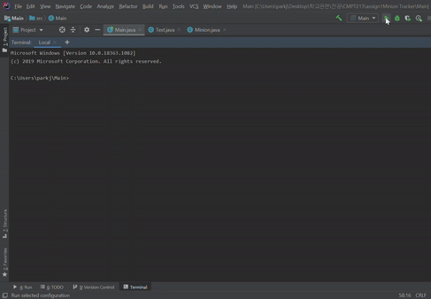

# Minion Tracker
Minion Tracker is a simple ```keyboard-driven program to add/remove/update Minions``` in terminal.  
Launch the application for detailed description of the application and commands.  

## Technology
Language Used: **Java**  
Development Tool: **IntelliJ**

## Setup
1) Download all the files.  
2) Open the files using Java development tool (Ex. IntelliJ).  
3) Run the application then description and how to use the application will be displayed in terminal.   

## Example

